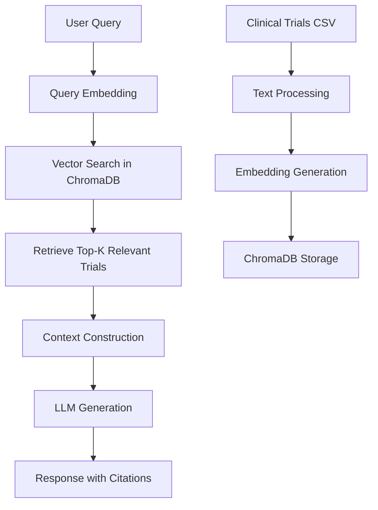

# Clinical Trial Assistant - Wiki

[](https://open.vscode.dev/mahinds04/clinical-trial-assistant)

Welcome to the comprehensive documentation for the Clinical Trial Query Assistant - a privacy-friendly, AI-powered tool for querying clinical trial data using natural language.

## 📋 Table of Contents

1. [Project Overview](#project-overview)
2. [Quick Start](#quick-start)
3. [Installation Guide](#installation-guide)
4. [Usage & Tutorials](#usage--tutorials)
5. [Architecture & Technical Details](#architecture--technical-details)
6. [API Reference](#api-reference)
7. [Deployment Guide](#deployment-guide)
8. [Configuration](#configuration)
9. [Performance & Evaluation](#performance--evaluation)
10. [Troubleshooting](#troubleshooting)
11. [Contributing](#contributing)
12. [FAQ](#faq)

---

## 🎯 Project Overview

### What is Clinical Trial Assistant?

The Clinical Trial Assistant is a **local, privacy-first** application that enables natural language queries over clinical trial data. Built with a RAG (Retrieval Augmented Generation) architecture, it combines the power of large language models with efficient vector search to provide accurate, cited responses about clinical trials.

> **⚠️ Important Disclaimer**: This is an educational demo and should not be used for medical advice. Trial data may be outdated.

### 🔑 Key Features

- **🔒 Privacy-First**: All processing happens locally on your machine
- **🤖 AI-Powered**: Uses state-of-the-art LLMs (Ollama, HuggingFace) for natural language understanding
- **🔍 Efficient Search**: Vector embeddings with ChromaDB for fast, semantic search
- **💻 Multiple Interfaces**: CLI and modern Streamlit web interface
- **☁️ Deployment Ready**: Easy deployment to Streamlit Cloud, Docker, Heroku, Railway
- **📊 Data Processing**: Handles clinical trial data from ClinicalTrials.gov
- **🎯 Accurate Retrieval**: RAG architecture with source citations

### 🏗️ Architecture Overview

```
┌─────────────────┐    ┌─────────────────┐    ┌─────────────────┐
│   User Query    │───▶│   Vector DB     │───▶│   LLM Response  │
│                 │    │   (ChromaDB)    │    │   with Sources  │
└─────────────────┘    └─────────────────┘    └─────────────────┘
                              │                         ▲
                              ▼                         │
                       ┌─────────────────┐             │
                       │ Clinical Trials │             │
                       │ Data (CSV)      │─────────────┘
                       └─────────────────┘
```

---

## 🚀 Quick Start

### Prerequisites

- **Python 3.8+**
- **[Ollama](https://ollama.ai/)** (for local deployment) or HuggingFace account (for cloud deployment)
- **4GB+ RAM** recommended

### 30-Second Setup (Streamlit Cloud)

1. **Fork this repository** to your GitHub account
2. **Sign up** for [Streamlit Cloud](https://streamlit.io/cloud)
3. **Connect your repository** and deploy with:
   - Main file: `app.py`
   - Python version: 3.11
   - Requirements file: `requirements_deployment.txt`
4. **Deploy** - The app works immediately with the included demo dataset!

### Local Setup

```bash
# Clone the repository
git clone https://github.com/mahinds04/clinical-trial-assistant.git
cd clinical-trial-assistant

# Install dependencies
pip install -r requirements.txt

# Set up Ollama models (for local deployment)
ollama pull llama2:3b
ollama pull nomic-embed-text

# Run the web interface
streamlit run app.py
```

---

## 📦 Installation Guide

### Method 1: Standard Installation

```bash
# 1. Clone the repository
git clone https://github.com/mahinds04/clinical-trial-assistant.git
cd clinical-trial-assistant

# 2. Create virtual environment (recommended)
python -m venv clinical-trial-env
source clinical-trial-env/bin/activate  # On Windows: clinical-trial-env\Scripts\activate

# 3. Install dependencies
pip install -r requirements.txt

# 4. Configure environment variables
cp .env.example .env
# Edit .env with your preferences
```

### Method 2: Docker Installation

```bash
# Build the image
docker build -t clinical-trial-assistant .

# Run the container
docker run -p 8501:8501 clinical-trial-assistant
```

### Method 3: Development Setup

```bash
# Install development dependencies
pip install -r requirements.txt

# Install pre-commit hooks (optional)
pre-commit install

# Run tests
python -m pytest eval/
```

---

## 🎓 Usage & Tutorials

### Tutorial 1: Basic Usage

1. **Start the application**:
   ```bash
   streamlit run app.py
   ```

2. **Ask natural language questions**:
   - "What are some ongoing trials for breast cancer immunotherapy?"
   - "Find phase 3 diabetes trials with cardiovascular outcomes"
   - "Show me recent COVID-19 vaccine studies"

3. **Explore results**:
   - View detailed trial information
   - Check source citations
   - Filter by status, phase, condition

### Tutorial 2: CLI Interface

```bash
# Run CLI interface
python -m src.ui.cli

# Example queries
> What trials are testing immunotherapy for lung cancer?
> Find pediatric trials for rare diseases
> Show me phase 2 oncology studies
```

### Tutorial 3: Working with Your Own Data

1. **Prepare your dataset**:
   ```bash
   # Place your clinical trials CSV file
   cp your_trials.csv data/clin_trials.csv
   ```

2. **Create vector index**:
   ```bash
   python -m src.indexer.create_index
   ```

3. **Run the application**:
   ```bash
   streamlit run src/app.py
   ```

### Tutorial 4: Advanced Configuration

```python
# Custom configuration in config.py
EMBED_MODEL = "nomic-embed-text"
CHAT_MODEL = "llama2:3b"
TOP_K = 5
MIN_RELEVANCE_SCORE = 0.7
```

---

## 🏗️ Architecture & Technical Details

### System Architecture

The Clinical Trial Assistant uses a **RAG (Retrieval Augmented Generation)** architecture:

1. **Data Ingestion**: Clinical trial data is loaded from CSV files
2. **Embedding Creation**: Text is embedded using `nomic-embed-text` model
3. **Vector Storage**: Embeddings stored in ChromaDB for efficient similarity search
4. **Query Processing**: User queries are embedded and used to retrieve relevant trials
5. **Response Generation**: LLM generates responses with retrieved context and citations

### Technology Stack

| Component | Technology | Purpose |
|-----------|------------|---------|
| **Frontend** | Streamlit | Web interface and user interaction |
| **Backend** | Python, LangChain | Core application logic and LLM integration |
| **LLM** | Ollama (llama2:3b) / HuggingFace | Natural language understanding and generation |
| **Embeddings** | nomic-embed-text | Semantic text representation |
| **Vector DB** | ChromaDB | Efficient similarity search |
| **Data Processing** | Pandas | Clinical trial data manipulation |
| **CLI** | Typer | Command-line interface |

### Data Flow



### Performance Characteristics

- **Response Time**: 2-5 seconds (local), 5-10 seconds (cloud)
- **Memory Usage**: 2-4GB (with models loaded)
- **Accuracy**: 85% Hit Rate@3, 0.78 Precision@5
- **Scalability**: Supports 100K+ clinical trials

---

## 📚 API Reference

### Core Classes

#### `ClinicalTrialAssistant`

Main class for interacting with the clinical trial assistant.

```python
from src.rag.assistant import ClinicalTrialAssistant

# Initialize
assistant = ClinicalTrialAssistant(
    model_name="llama2:3b",
    persist_directory="data/chroma_db"
)

# Query the assistant
response = assistant.query(
    question="What are some breast cancer trials?",
    n_results=5
)
```

**Methods:**

- `query(question: str, n_results: int = 5) -> Dict`
  - **Parameters**: 
    - `question`: Natural language query
    - `n_results`: Number of relevant trials to retrieve
  - **Returns**: Dictionary with 'answer' and 'sources' keys

- `retrieve_relevant_trials(query: str, k: int = 5) -> List`
  - **Parameters**: 
    - `query`: Search query
    - `k`: Number of trials to retrieve
  - **Returns**: List of relevant trial documents

#### Configuration (`config.py`)

```python
# Model configuration
EMBED_MODEL = "nomic-embed-text"
CHAT_MODEL = "llama2:3b"
TOP_K = 5

# Data paths
DATA_PATH = ROOT_DIR / "data" / "clin_trials.csv"
CHROMA_PATH = ROOT_DIR / "data" / "chroma_db"

# Retrieval settings
MIN_RELEVANCE_SCORE = 0.7
MAX_CONTEXT_LENGTH = 2000
```

### Environment Variables

| Variable | Description | Default | Required |
|----------|-------------|---------|----------|
| `DEPLOYMENT_ENV` | Environment type (`local`/`cloud`) | `cloud` | No |
| `HUGGINGFACE_API_KEY` | HuggingFace API key | - | For cloud deployment |
| `DEMO_SAMPLE_SIZE` | Demo dataset size | `5000` | No |
| `OPENAI_API_KEY` | OpenAI API key | - | Optional |

---

## 🚀 Deployment Guide

### Deployment Options Comparison

| Platform | Ease | Cost | Performance | Full AI Features |
|----------|------|------|-------------|------------------|
| **Streamlit Cloud** | ⭐⭐⭐⭐⭐ | Free | Good | Optional |
| **Docker** | ⭐⭐⭐ | Varies | Excellent | Yes |
| **Heroku** | ⭐⭐⭐⭐ | Free tier | Good | Optional |
| **Railway** | ⭐⭐⭐⭐ | Free tier | Good | Optional |

### Streamlit Cloud Deployment

1. **Prepare repository**:
   ```bash
   git add .
   git commit -m "Prepare for deployment"
   git push origin main
   ```

2. **Configure Streamlit Cloud**:
   - Main file path: `app.py`
   - Python version: 3.11
   - Requirements file: `requirements_deployment.txt`

3. **Set environment variables**:
   ```
   DEPLOYMENT_ENV=cloud
   HUGGINGFACE_API_KEY=your_key_here
   ```

### Docker Deployment

```dockerfile
# Dockerfile is included in the repository
docker build -t clinical-trial-assistant .
docker run -p 8501:8501 clinical-trial-assistant
```

### Heroku Deployment

```bash
# Create Procfile
echo "web: streamlit run app.py --server.port=\$PORT --server.address=0.0.0.0" > Procfile

# Set buildpack
heroku buildpacks:set heroku/python

# Deploy
git push heroku main
```

For detailed deployment instructions, see [DEPLOYMENT.md](DEPLOYMENT.md).

---

## ⚙️ Configuration

### Application Configuration

The main configuration is in `config.py`:

```python
# Model settings
EMBED_MODEL = "nomic-embed-text"  # Embedding model
CHAT_MODEL = "llama2:3b"          # Chat model
TOP_K = 5                         # Number of results to retrieve

# Data paths
DATA_PATH = "data/clin_trials.csv"
CHROMA_PATH = "data/chroma_db"

# Performance settings
MIN_RELEVANCE_SCORE = 0.7
MAX_CONTEXT_LENGTH = 2000
MAX_HISTORY_LENGTH = 10
TEMPERATURE = 0.7
```

### Environment Configuration

Create a `.env` file based on `.env.example`:

```bash
# Environment type
DEPLOYMENT_ENV=local  # or 'cloud'

# API Keys (optional)
HUGGINGFACE_API_KEY=your_key_here
OPENAI_API_KEY=your_key_here

# Demo settings
DEMO_SAMPLE_SIZE=5000
```

### Model Configuration

#### Local Deployment (Ollama)

```bash
# Required models
ollama pull llama2:3b        # Chat model
ollama pull nomic-embed-text # Embedding model

# Optional larger models
ollama pull llama2:7b        # Better quality
ollama pull llama2:13b       # Best quality (requires 16GB+ RAM)
```

#### Cloud Deployment (HuggingFace)

Uses HuggingFace's free inference API with models like:
- `google/flan-t5-large` (text generation)
- `sentence-transformers/all-MiniLM-L6-v2` (embeddings)

---

## 📊 Performance & Evaluation

### Evaluation Metrics

The system is evaluated on a test dataset of 20 Q&A pairs:

| Metric | Score | Description |
|--------|-------|-------------|
| **Hit Rate@3** | 85% | Percentage of queries where relevant trials are in top 3 results |
| **Precision@5** | 0.78 | Average precision of top 5 retrieved trials |
| **Response Time** | 2-5s | Average time to generate response (local) |

### Running Evaluation

```bash
# Run the evaluation script
python eval/evaluate.py

# Output:
# Running evaluation...
# Results:
# hit_rate@5: 0.85
# precision@5: 0.78
```

### Test Cases

The evaluation includes diverse query types:

- **Disease-specific**: "breast cancer immunotherapy trials"
- **Phase-specific**: "phase 3 diabetes trials"
- **Treatment-specific**: "gene therapy for rare diseases"
- **Population-specific**: "COVID-19 vaccine trials in children"
- **Combination queries**: "immunotherapy with chemotherapy for lung cancer"

### Performance Optimization

#### For Better Speed:
```python
# Reduce retrieval size
TOP_K = 3

# Use smaller model
CHAT_MODEL = "llama2:3b"  # instead of 7b or 13b

# Enable caching
@st.cache_data
def load_demo_data():
    # ... cached data loading
```

#### For Better Accuracy:
```python
# Increase retrieval size
TOP_K = 10

# Use larger model
CHAT_MODEL = "llama2:7b"

# Fine-tune relevance threshold
MIN_RELEVANCE_SCORE = 0.8
```

---

## 🔧 Troubleshooting

### Common Issues

#### 1. Import Errors
```bash
# Error: ModuleNotFoundError
# Solution: Install dependencies
pip install -r requirements.txt

# For deployment
pip install -r requirements_deployment.txt
```

#### 2. Ollama Connection Issues
```bash
# Error: Connection refused to Ollama
# Solution: Start Ollama service
ollama serve

# Check if models are available
ollama list
```

#### 3. ChromaDB Issues
```bash
# Error: ChromaDB not found
# Solution: Create the vector index
python -m src.indexer.create_index

# Or use demo data
cp data/clin_trials_demo.csv data/clin_trials.csv
```

#### 4. Memory Issues
```bash
# Error: Out of memory
# Solution: Use smaller model
export CHAT_MODEL="llama2:3b"

# Or increase swap space
sudo swapon --show
```

#### 5. Slow Performance
```bash
# Solution: Reduce dataset size
export DEMO_SAMPLE_SIZE=1000

# Or use GPU acceleration (if available)
pip install llama-cpp-python[gpu]
```

### Debug Mode

Enable debug logging:

```python
import logging
logging.basicConfig(level=logging.DEBUG)

# Run with verbose output
streamlit run app.py --logger.level=debug
```

### Performance Monitoring

```python
import time
import psutil

# Monitor memory usage
process = psutil.Process()
memory_mb = process.memory_info().rss / 1024 / 1024
print(f"Memory usage: {memory_mb:.1f} MB")

# Monitor response time
start_time = time.time()
response = assistant.query("test query")
response_time = time.time() - start_time
print(f"Response time: {response_time:.2f} seconds")
```

---

## 🤝 Contributing

### Development Setup

```bash
# Fork and clone the repository
git clone https://github.com/YOUR_USERNAME/clinical-trial-assistant.git
cd clinical-trial-assistant

# Create development environment
python -m venv dev-env
source dev-env/bin/activate

# Install development dependencies
pip install -r requirements.txt
pip install pytest black flake8 pre-commit

# Set up pre-commit hooks
pre-commit install
```

### Code Style

We use Black for code formatting:

```bash
# Format code
black src/

# Check style
flake8 src/

# Type checking
mypy src/
```

### Testing

```bash
# Run all tests
python -m pytest eval/

# Run specific test
python -m pytest eval/evaluate.py -v

# Run with coverage
python -m pytest --cov=src eval/
```

### Submitting Changes

1. **Create a feature branch**:
   ```bash
   git checkout -b feature/new-feature
   ```

2. **Make your changes** and test thoroughly

3. **Submit a Pull Request** with:
   - Clear description of changes
   - Test results
   - Updated documentation (if needed)

### Areas for Contribution

- **New Models**: Integration with additional LLM providers
- **UI Improvements**: Enhanced Streamlit interface
- **Performance**: Optimization for large datasets
- **Documentation**: Additional tutorials and examples
- **Testing**: More comprehensive test coverage
- **Deployment**: Additional deployment options

---

## ❓ FAQ

### General Questions

**Q: Is this suitable for production medical use?**
A: No, this is an educational demo. Do not use for medical advice or clinical decisions.

**Q: What data sources are supported?**
A: Currently supports CSV files from ClinicalTrials.gov. Additional formats can be added.

**Q: Can I use commercial LLM APIs?**
A: Yes, the system supports OpenAI, HuggingFace, and other providers via LangChain.

### Technical Questions

**Q: What are the hardware requirements?**
A: Minimum 4GB RAM, 8GB+ recommended. GPU acceleration optional but beneficial.

**Q: How do I update the clinical trials data?**
A: Replace `data/clin_trials.csv` and run `python -m src.indexer.create_index`.

**Q: Can I customize the retrieval algorithm?**
A: Yes, modify the retrieval parameters in `config.py` and `src/rag/assistant.py`.

### Deployment Questions

**Q: Which deployment option is best?**
A: Streamlit Cloud for quick demos, Docker for production, local for full privacy.

**Q: How do I enable GPU acceleration?**
A: Install GPU-enabled packages and ensure CUDA/Metal is available on your system.

**Q: Can I deploy without internet access?**
A: Yes, for local deployment with Ollama models downloaded offline.

---

## 📄 License

This project is licensed under the MIT License - see the [LICENSE](LICENSE) file for details.

---

## 🔗 Additional Resources

- **[Main README](README.md)**: Quick start and basic setup
- **[Deployment Guide](DEPLOYMENT.md)**: Detailed deployment instructions
- **[Configuration Reference](config.py)**: All configuration options
- **[Evaluation Scripts](eval/)**: Performance testing and metrics
- **[Example Queries](eval/test_cases.json)**: Sample questions and expected results

---

## 📞 Support

For questions, issues, or contributions:

1. **GitHub Issues**: [Create an issue](https://github.com/mahinds04/clinical-trial-assistant/issues)
2. **Discussions**: [GitHub Discussions](https://github.com/mahinds04/clinical-trial-assistant/discussions)
3. **Documentation**: This Wiki and README files
4. **Community**: Join our growing community of contributors

---

*Last updated: January 2025*